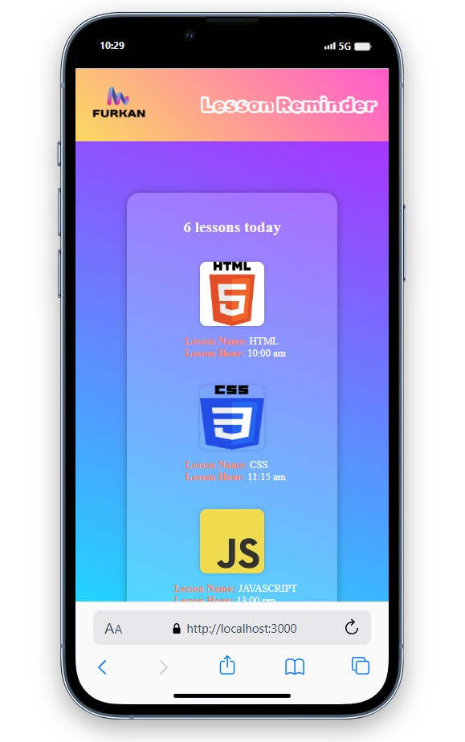
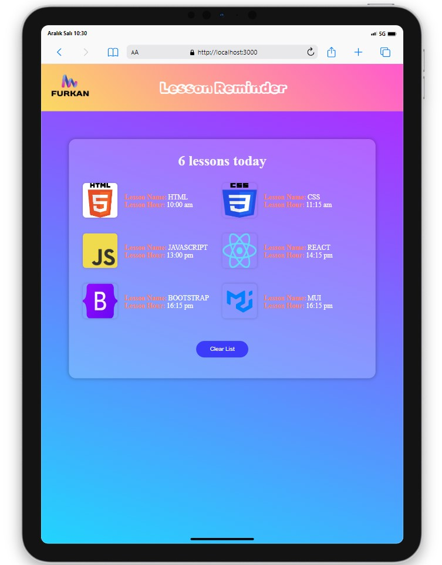
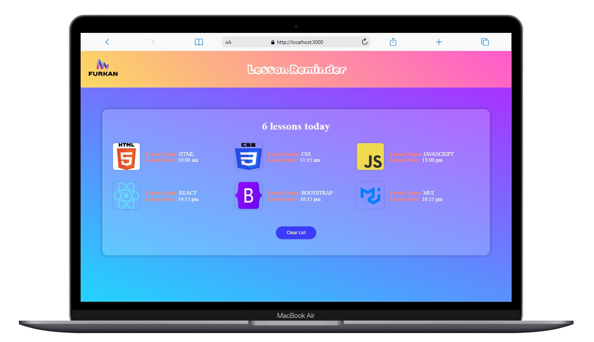

# Lesson Reminder App

<div align="center">
  
</div>

Lesson Reminder Application is a web application designed with React to help users organise and remember their lessons.

## Live Project Link

You can access the live version of the project [here](https://les-rem-v2.vercel.app/).

```
Lesson Reminder (folder)
|
|----readme.md         
SOLUTION
├── public
│     └── index.html
├── src
│    ├── App.js
│    ├── components
│    │   ├── Header
│    │   │   ├── Header.css
│    │   │   └── Header.jsx
│    │   └── LessonCard
│    │       ├── LessonCard.jsx
│    │       └── lesson.module.css
│    ├── helper
│    │   └── data.js
│    ├── pages
│    │   └── Lesson.jsx
│    ├── index.css
│    ├── index.js
├── package.json
└── yarn.lock

```

## Screenshots

<div align="center">
  
  
  
</div>

## Compatibility

The project is compatible with both wide-screen computers and mobile devices.
